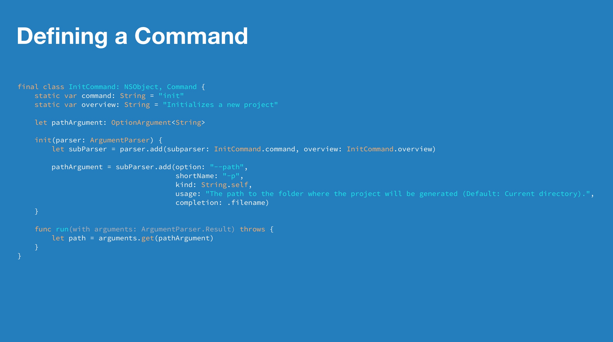

# [fit] Building Swift CLIs
### Marek Fořt

---
[.header: #FFFFFF]


### [fit] Wait a minute, who are you?

---

[.column]

# Marek Fořt
<br>

- Ackee iOS Developer

- Tuist core contributor

- CTU student

[.column]


---

# Why should I use Swift for CLI

- Tool for iOS developers
    - Easy contribution
- I love Swift
- Tools I am familiar with

---

# But how do I build one?


---

# Libraries<br>by Swift Community

# ⚔️

# Libraries<br>that Apple provides us

---

# How does Apple do it?

### Swift Package Manager

---

SPM's Swift 5.0 Package.swift

[.code-highlight: all]
[.code-highlight: 7-8]

```swift
.library(
    name: "SwiftPM",
    targets: [
        "clibc",
        "SPMLibc",
        "POSIX",
        "Basic",
        "SPMUtility",
        "SourceControl",
        "SPMLLBuild",
        "PackageModel",
        "PackageLoading",
        "PackageGraph",
        "Build",
        "Xcodeproj",
        "Workspace"
    ]
),
```

---

# Now
[.code-highlight: 1-4]
[.code-highlight: 6-8]

```swift
dependencies: [
    .package(url: "https://github.com/apple/swift-tools-support-core.git",
            .branch("master")),
]

.library(
    name: "SwiftToolsSupport", targets: ["TSCBasic", "TSCUtility"]
)
```

---

# TSCBasic

- File *paths*
- Process (command line commands)
- Terminal controller (colored output)
- Output streams
- Additional extensions and algorithms

---

# Basic example

[.code-highlight: 1]
[.code-highlight: 2]
[.code-highlight: 3-4]
[.code-highlight: 5-6]
[.code-highlight: 7-8]
[.code-highlight: all]
```swift
let myAbsolutePath = AbsolutePath("/switzerland") 
let myRelativePath = RelativePath("conference")
var combinedPath = myAbsolutePath.appending(myRelativePath) 
// /switzerland/conference
combinedPath = combinedPath.appending(component: "appbuilders")
// /switzerland/conference/appbuilders
combinedPath = combinedPath.appending(components: "appbuilders2020", "my_presentation")
// /switzerland/conference/appbuilders/appbuilders2020/my_presentation
```

---

# TSCUtility

- Helpers for CLI development
- Argument parser
- Command definition
- Version struct
- Progress animations
- ...

---

# Defining a Command

```swift
final class InitCommand: NSObject, Command {
    static var command: String = "init"

    let pathArgument: OptionArgument<String>

    init(parser: ArgumentParser) {
        let subParser = parser.add(subparser: InitCommand.command, overview: InitCommand.overview)

        pathArgument = subParser.add(option: "--path",
                                     shortName: "-p",
                                     kind: String.self,
                                     usage: "The path to the folder where the project will be generated.",
                                     completion: .filename)
    }

    func run(with arguments: ArgumentParser.Result) throws {
        let path = arguments.get(pathArgument)
    }
}
```

--- 


# Only 2019 kids will remember this...

---

# [fit] Swift Argument<br>Parser

---

[.code-highlight: 1]
[.code-highlight: 2-3, 12-13]
[.code-highlight: 5-7]
[.code-highlight: 10]
[.code-highlight: all]

```swift
struct InitCommand: ParsableCommand {
    @Option(name: .shortAndLong)
    var path: String?
    
    func run() throws {
        // Generate to path
    }
}

InitCommand.main()

init --path my_path
init -p my_path
```

---

# Tests ✅ & Errors 🔥
- Developers expect reliable tools
- Errors should have helpful messages
- Errors as first-class citizens
- Test for your errors

---

# Dependency injection

[.code-highlight: 1, 3-8]
```swift
struct InitCommand: ParsableCommand {
    ...
    private let myService: MyServicing
    init(myService: MyServicing) {
        self.myService = myService
    }
}
```

---

🛑 Type 'InitCommand' does not conform to protocol 'ParsableArguments'

[.code-highlight: 1-4]
```swift
public protocol ParsableArguments: Decodable {
  /// Creates an instance of this parsable type using the definitions
  /// given by each property's wrapper.
  init()
  
  /// Validates the properties of the instance after parsing.
  ///
  /// Implement this method to perform validation or other processing after
  /// creating a new instance from command-line arguments.
  mutating func validate() throws
}
```

---

# Introducing Services

[.code-highlight: 1]
[.code-highlight: 2-5]
[.code-highlight: 6-9]
[.code-highlight: 11-20]
[.code-highlight: all]

```swift
struct InitService {
    private let myService: MyServicing
    init(myService: MyServicing = MyService()) {
        self.myService = myService
    }

    func run() throws {
        myService.someAction()
    }
}

struct InitCommand: ParsableCommand {
    ...
    func run() throws {
        try InitService().run()
    }
}
```

---

# Services

- Solve dependency injection
- Commands become plain parsers without any logic
    - Easy testability

---

# [fit] Demo time 🕹️

---

# What we have learned

- How to use new ArgumentParser
- Leveraging Swift tools support libraries
- How to test our CLI tools

---

# Thanks for you attention! 🥳

### Feel free to ask any questions in hopin<br>or on Twitter @marekfort